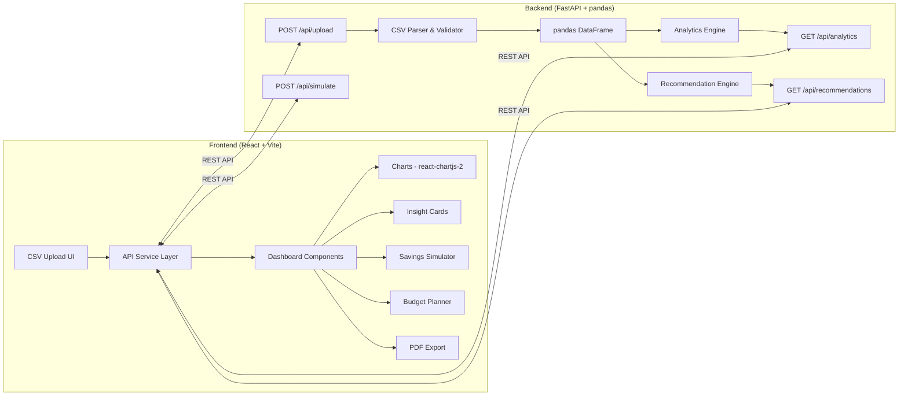

# SpendSmart — Personalized Saving Suggestion Engine

Analyze 30 days of spending data from a CSV upload and generate specific, personalized savings suggestions with estimated monthly impact.

**Full-stack architecture**: Python FastAPI backend (pandas analytics) + React Vite frontend (Chart.js dashboard).

---

## Architecture Overview



### Tech Stack

| Layer | Technology | Why |
|-------|-----------|-----|
| **Backend** | Python FastAPI | Async, auto-generated Swagger docs, Pydantic validation |
| **Analytics** | pandas + numpy | Industry-standard for data analysis, IQR outlier detection |
| **Frontend** | React 18 + Vite | Fast HMR, modern component architecture, shows framework skills |
| **Charts** | Chart.js 4 + react-chartjs-2 | Lightweight, beautiful, React-native bindings |
| **HTTP Client** | axios | Clean API calls with interceptors |
| **PDF Export** | jsPDF + html2canvas | Client-side PDF generation |
| **Styling** | Vanilla CSS | Full control, premium dark theme with glassmorphism |
| **Fonts** | Google Fonts — Inter | Clean, modern, highly readable |
| **Icons** | react-icons (Lucide set) | Tree-shakeable icon components |

---

## Scoring Alignment

| Criteria | Weight | How We Address It |
|----------|--------|-------------------|
| **Insight Quality** | 40% | 8+ rule-based recommendations with ₹ savings estimates, pandas-powered pattern detection (weekday vs weekend, merchant frequency, subscription sniffing, IQR outliers), personalized tips |
| **Visualization** | 30% | 4 chart types (donut, bar, line, horizontal bar), animated transitions, glassmorphism cards, responsive dark-mode dashboard |
| **Logic** | 20% | Robust CSV validation with pandas, numpy IQR outlier detection, trend analysis, category benchmarking, what-if simulator math — all server-side |
| **Code Quality** | 10% | Clean separation: FastAPI backend + React frontend, Pydantic models, modular components, proper API design |

---

## Project Structure

```
spend_smart/
├── backend/
│   ├── main.py                 # FastAPI app, CORS, routes
│   ├── analytics.py            # pandas analytics engine
│   ├── recommendations.py      # Rule-based recommendation engine
│   ├── models.py               # Pydantic request/response models
│   ├── sample_data.csv         # Bundled sample dataset
│   └── requirements.txt        # Python dependencies
│
├── frontend/
│   ├── index.html              # Vite entry HTML
│   ├── package.json
│   ├── vite.config.js          # Dev proxy to backend
│   ├── src/
│   │   ├── main.jsx            # React entry point
│   │   ├── App.jsx             # Root component, screen routing
│   │   ├── index.css           # Global styles, design system
│   │   ├── services/
│   │   │   └── api.js          # axios instance + API functions
│   │   ├── components/
│   │   │   ├── UploadScreen.jsx    # Hero + drag-and-drop upload
│   │   │   ├── Dashboard.jsx       # Main dashboard layout
│   │   │   ├── SummaryBar.jsx      # KPI stat cards
│   │   │   ├── CategoryChart.jsx   # Donut chart
│   │   │   ├── DailyChart.jsx      # Bar chart - daily spend
│   │   │   ├── MerchantChart.jsx   # Horizontal bar - top merchants
│   │   │   ├── WeekdayChart.jsx    # Grouped bar - weekday vs weekend
│   │   │   ├── InsightCards.jsx    # Recommendation cards list
│   │   │   ├── Simulator.jsx       # What-if savings sliders
│   │   │   ├── BudgetPlanner.jsx   # Budget inputs + progress bars
│   │   │   └── PDFExport.jsx       # Export button + logic
│   │   └── utils/
│   │       └── formatters.js       # Currency, date, % formatters
│   └── public/
│
├── problem_statement.txt
└── README.md
```

---

## Proposed Changes

### Component 1: Backend (Python FastAPI)

---

#### [NEW] [requirements.txt](file:///home/harsh-tandon/spend_smart/backend/requirements.txt)
```
fastapi
uvicorn[standard]
pandas
numpy
python-multipart
```

---

#### [NEW] [models.py](file:///home/harsh-tandon/spend_smart/backend/models.py)
Pydantic models for type-safe API contracts:

```python
class Transaction(BaseModel):
    date: str
    merchant: str
    amount: float
    category: str

class CategoryTotal(BaseModel):
    category: str
    total: float
    percentage: float
    count: int

class DailySpend(BaseModel):
    date: str
    total: float

class MerchantTotal(BaseModel):
    merchant: str
    total: float
    count: int

class Insight(BaseModel):
    title: str
    description: str
    savings_estimate: float
    icon: str           # icon name for frontend
    priority: str       # "high" | "medium" | "low"
    category: str       # which category this relates to

class AnalyticsResponse(BaseModel):
    total_spend: float
    daily_average: float
    transaction_count: int
    date_range: dict
    category_totals: list[CategoryTotal]
    daily_spend: list[DailySpend]
    top_merchants: list[MerchantTotal]
    weekday_vs_weekend: dict
    
class SimulationRequest(BaseModel):
    reductions: dict[str, float]  # category -> % reduction

class SimulationResponse(BaseModel):
    original_total: float
    projected_total: float
    total_savings: float
    category_savings: dict[str, float]
```

---

#### [NEW] [analytics.py](file:///home/harsh-tandon/spend_smart/backend/analytics.py)
pandas-powered analytics engine:

- `parse_and_validate(file)` — Read CSV with pandas, validate columns (`Date`, `Merchant`, `Amount`, `Category`), clean data types, return DataFrame
- `get_category_totals(df)` — `groupby('Category').agg(sum, count)`, compute percentages
- `get_daily_spend(df)` — `groupby('Date').sum()`, fill missing dates with 0
- `get_top_merchants(df, n=5)` — `groupby('Merchant').sum().nlargest(n)`
- `get_weekday_vs_weekend(df)` — Add `is_weekend` column via `pd.to_datetime().dt.dayofweek`, aggregate
- `detect_outliers(df, category)` — IQR method: `Q1, Q3 = df.quantile([0.25, 0.75])`, flag anything > `Q3 + 1.5 * IQR`
- `get_subscription_candidates(df)` — Group by merchant, find those with ≥3 occurrences and low amount variance (std/mean < 0.2)
- `simulate_savings(df, reductions)` — Apply % reductions per category, return projected totals

---

#### [NEW] [recommendations.py](file:///home/harsh-tandon/spend_smart/backend/recommendations.py)
Rule-based engine that takes a DataFrame and returns a list of `Insight` objects:

| # | Rule | Logic | Example Output |
|---|------|-------|----------------|
| 1 | High-category cut | If top category > 35% of total, suggest 20% reduction | "Reduce Food by 20% → Save ₹1,200/mo" |
| 2 | Weekend spike | If weekend avg > 1.5× weekday avg | "Weekend spending is 60% higher — set a weekend budget" |
| 3 | Subscription sniff | Recurring merchant, low amount variance, ≥3 times | "Cancel unused Netflix subscription → Save ₹499/mo" |
| 4 | Merchant concentration | If single merchant > 15% of total | "You spent ₹2,400 at Zomato — try meal prepping" |
| 5 | Outlier alert | Transaction > Q3 + 1.5×IQR for its category | "Unusual ₹3,200 Shopping charge on Jan 18" |
| 6 | Travel optimization | If Travel category exists and avg trip > ₹150 | "Consider Metro card → Save ₹X/mo" |
| 7 | Daily budget | If daily avg exceeds a target threshold | "Your daily average is ₹X — aim for ₹Y to save 15%" |
| 8 | Savings target | Calculate what 10% and 20% savings require | "To save 20%, cut ₹X across Food and Travel" |

Each insight includes a `savings_estimate` in ₹ and a `priority` level.

---

#### [NEW] [main.py](file:///home/harsh-tandon/spend_smart/backend/main.py)
FastAPI application with CORS and routes:

```python
# Endpoints:
POST /api/upload          # Upload CSV → parse → store in memory → return analytics + recommendations
GET  /api/analytics       # Return cached analytics for current dataset
GET  /api/recommendations # Return cached recommendations
POST /api/simulate        # Accept {reductions: {category: %}} → return projected savings
GET  /api/sample          # Load bundled sample_data.csv → return analytics + recommendations
```

- CORS middleware allowing `localhost:5173` (Vite dev server)
- In-memory DataFrame storage (simple global, fine for single-user hackathon demo)
- File upload via `python-multipart`

---

#### [NEW] [sample_data.csv](file:///home/harsh-tandon/spend_smart/backend/sample_data.csv)
~70 transactions over 30 days with realistic Indian spending patterns:
- **Categories**: Food, Travel, Shopping, Entertainment, Subscriptions, Utilities, Health
- **Merchants**: Zomato, Swiggy, Uber, Ola, Amazon, Flipkart, BigBasket, Netflix, Spotify, Jio
- **Patterns baked in**: Weekend spikes, recurring subscriptions, 2-3 outlier transactions

---

### Component 2: Frontend (React + Vite)

---

#### [NEW] Frontend scaffold via `npx create-vite`
Initialize React project with Vite in `frontend/` directory.

**npm packages to install:**
```
chart.js react-chartjs-2 axios react-icons jspdf html2canvas
```

---

#### [NEW] [vite.config.js](file:///home/harsh-tandon/spend_smart/frontend/vite.config.js)
Dev server proxy — routes `/api/*` to `localhost:8000` so frontend can call backend without CORS issues in dev:
```js
server: {
  proxy: {
    '/api': 'http://localhost:8000'
  }
}
```

---

#### [NEW] [index.css](file:///home/harsh-tandon/spend_smart/frontend/src/index.css)
Premium dark-mode design system:
- **Palette**: Deep navy background (`#0a0e27`), card surfaces (`rgba(255,255,255,0.05)`), accent gradients (cyan `#00d4ff` → purple `#7b2ff7`)
- **Glassmorphism**: `backdrop-filter: blur(20px)`, subtle borders
- **Typography**: Inter font, fluid scale
- **Component classes**: `.card`, `.stat-card`, `.insight-card`, `.btn-primary`, `.btn-ghost`, `.upload-zone`, `.slider-group`, `.progress-bar`
- **Animations**: `@keyframes fadeInUp`, `@keyframes countUp`, card hover lift, chart entry transitions
- **Responsive**: CSS Grid dashboard, collapses to single column on mobile

---

#### [NEW] [api.js](file:///home/harsh-tandon/spend_smart/frontend/src/services/api.js)
axios instance + typed API functions:
```js
export const uploadCSV = (file) => api.post('/api/upload', formData)
export const loadSample = () => api.get('/api/sample')
export const getAnalytics = () => api.get('/api/analytics')
export const getRecommendations = () => api.get('/api/recommendations')
export const simulate = (reductions) => api.post('/api/simulate', { reductions })
```

---

#### [NEW] [App.jsx](file:///home/harsh-tandon/spend_smart/frontend/src/App.jsx)
Root component managing two screens:
- `screen === 'upload'` → `<UploadScreen />`
- `screen === 'dashboard'` → `<Dashboard />`

Holds top-level state: `analyticsData`, `recommendations`, `loading`, `error`.

---

#### [NEW] [UploadScreen.jsx](file:///home/harsh-tandon/spend_smart/frontend/src/components/UploadScreen.jsx)
- Hero section with app title, tagline, animated gradient background
- Drag-and-drop zone with file icon, "or click to browse" text
- "Try with Sample Data" button
- Loading spinner during upload/parse
- Error toast for invalid CSV

---

#### [NEW] [Dashboard.jsx](file:///home/harsh-tandon/spend_smart/frontend/src/components/Dashboard.jsx)
Main layout — sticky nav + scrollable sections:
1. Summary Bar (KPIs)
2. Charts Grid (2×2)
3. Insights
4. Simulator
5. Budget Planner
6. Export button (floating)

---

#### [NEW] [SummaryBar.jsx](file:///home/harsh-tandon/spend_smart/frontend/src/components/SummaryBar.jsx)
4 glassmorphism stat cards:
- 💰 Total Spend (with animated count-up)
- 📊 Daily Average
- 🏆 Top Category (with % badge)
- 💡 Potential Savings (sum of all recommendation estimates)

---

#### [NEW] Chart Components (4 files)
| Component | Chart Type | Data |
|-----------|-----------|------|
| `CategoryChart.jsx` | Donut | Category breakdown with % labels |
| `DailyChart.jsx` | Bar | 30-day daily spend with trend line |
| `MerchantChart.jsx` | Horizontal bar | Top 5 merchants |
| `WeekdayChart.jsx` | Grouped bar | Weekday vs Weekend by category |

All use dark-theme colors, custom tooltips, smooth entry animations.

---

#### [NEW] [InsightCards.jsx](file:///home/harsh-tandon/spend_smart/frontend/src/components/InsightCards.jsx)
- Maps over `recommendations` array
- Each card: icon + title + description + savings badge (₹)
- Color-coded priority border (red/amber/green)
- Staggered fade-in animation

---

#### [NEW] [Simulator.jsx](file:///home/harsh-tandon/spend_smart/frontend/src/components/Simulator.jsx) *(Stretch)*
- Range slider per category (0–50% reduction)
- Calls `POST /api/simulate` on change (debounced)
- Real-time display: projected monthly savings counter
- Visual breakdown bar per category

---

#### [NEW] [BudgetPlanner.jsx](file:///home/harsh-tandon/spend_smart/frontend/src/components/BudgetPlanner.jsx) *(Stretch)*
- Editable budget input per category
- Progress bar: actual vs budget (green < 80%, amber < 100%, red > 100%)
- Total budget vs total spend comparison

---

#### [NEW] [PDFExport.jsx](file:///home/harsh-tandon/spend_smart/frontend/src/components/PDFExport.jsx) *(Stretch)*
- Floating "Export PDF" button
- Uses html2canvas to capture dashboard sections
- jsPDF to assemble multi-page report: summary → charts → insights

---

#### [NEW] [formatters.js](file:///home/harsh-tandon/spend_smart/frontend/src/utils/formatters.js)
```js
export const formatCurrency = (n) => `₹${n.toLocaleString('en-IN')}`
export const formatPercent = (n) => `${n.toFixed(1)}%`
export const formatDate = (d) => new Date(d).toLocaleDateString('en-IN', { ... })
```

---

## API Contract Summary

| Method | Endpoint | Request | Response |
|--------|----------|---------|----------|
| `POST` | `/api/upload` | `multipart/form-data` (CSV file) | `{ analytics: AnalyticsResponse, recommendations: Insight[] }` |
| `GET` | `/api/sample` | — | `{ analytics: AnalyticsResponse, recommendations: Insight[] }` |
| `GET` | `/api/analytics` | — | `AnalyticsResponse` |
| `GET` | `/api/recommendations` | — | `Insight[]` |
| `POST` | `/api/simulate` | `{ reductions: { category: % } }` | `SimulationResponse` |

---

## Verification Plan

### Automated Tests
1. Start backend: `cd backend && uvicorn main:app --reload`
2. Start frontend: `cd frontend && npm run dev`
3. Test sample data flow end-to-end via browser
4. Verify all 4 charts render with correct data
5. Verify all 8+ insights appear with ₹ estimates
6. Test simulator sliders update savings in real-time
7. Test PDF export produces a downloadable file

### Manual Verification
- Browser walkthrough recording of full flow
- Responsive check at mobile width
- Verify Swagger docs at `localhost:8000/docs`
